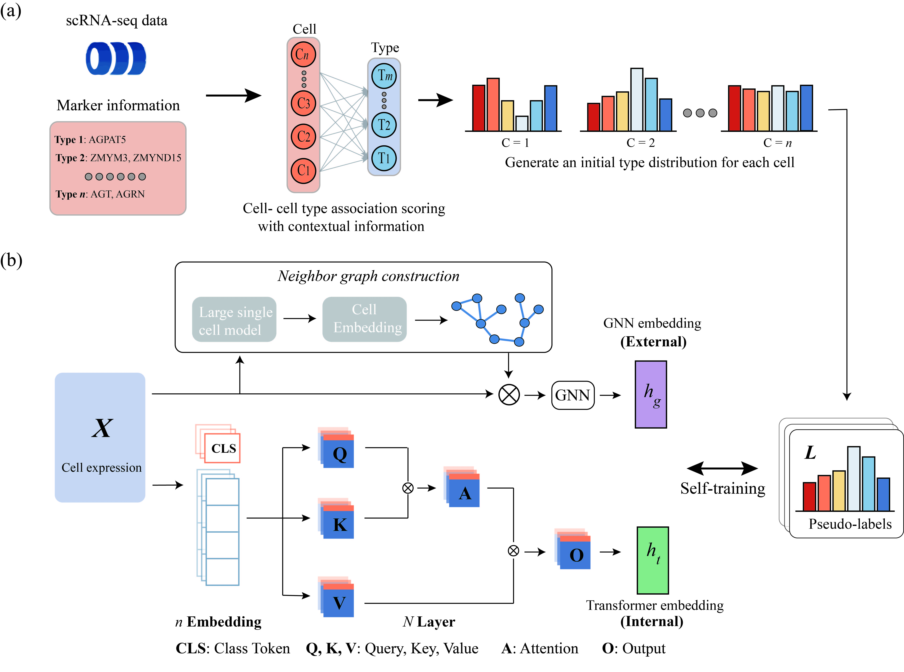

# sCDCTA: Contextualized association scoring and Dual-view networks for Cell Type Annotation 

The full description of sCDCTA and its application on published single cell RNA-seq datasets are available.

The repository includes detailed installation instructions and requirements, scripts and demos.


## 1 The workflow of sCDCTA.



The workflow of sCDCTA **(a)** Pseudo-labels are generated by combining cell expression data with
specificity and contextualised scores of the marker genes. **(b)**  A dual-view network architecture is utilised to integrate the internal and external information of cells, which is followed by a linear layer to obtain cell type annotations. During training, the model is then iteratively improved by self-training.

## 2 Requirements

+ Linux/UNIX/Windows system
+ Python == 3.8.6
+ torch == 1.8.1
+ scanpy == 1.9.8

Topic_gene_embedding

## 3 Usage

### Data format

sCDCTA requires an input in .h5ad object format. Includes: cell-by-cell gene matrix and cell type information and pseudo-labeling information for CAS.
sCDCTA requires an input in .npz object format. Includes: a network of associations between cells.
We provide default data for users to understand and debug sCDCTA code.

### Installation and implementation

**Installation via github:**

Download sCDCTA via github clone, you can run it directly by main.py file.
```bash
python main.py
```

## Reference

If you use `sCDCTA` in your work, please cite